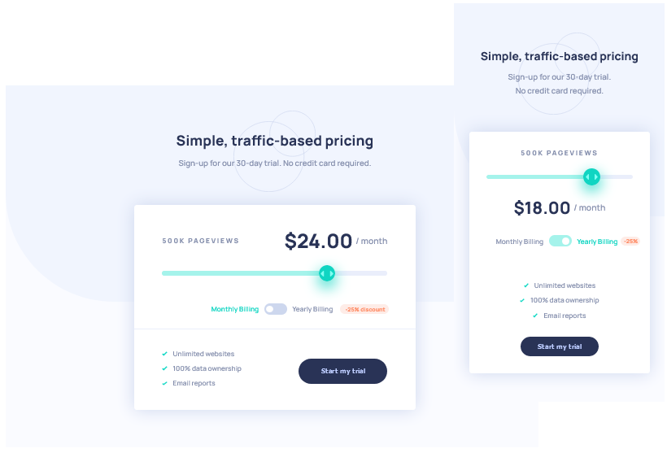

# Frontend Mentor - Interactive pricing component solution

This is a solution to the [Interactive pricing component challenge on Frontend Mentor](https://www.frontendmentor.io/challenges/interactive-pricing-component-t0m8PIyY8). Frontend Mentor challenges help you improve your coding skills by building realistic projects.

## Table of contents

- [Overview](#overview)
  - [The challenge](#the-challenge)
  - [Screenshot](#screenshot)
  - [Links](#links)
- [My process](#my-process)
  - [Built with](#built-with)
  - [What I learned](#what-i-learned)
  - [Continued development](#continued-development)
- [Author](#author)

## Overview

### The challenge

Users should be able to:

- View the optimal layout for the app depending on their device's screen size
- See hover states for all interactive elements on the page
- Use the slider and toggle to see prices for different page view numbers

### Screenshot

### Links

- Solution URL: [My solution](https://adoring-meitner-632781.netlify.app/)

## My process

### Built with

- Semantic HTML5 markup
- CSS custom properties
- Flexbox
- CSS Grid
- Mobile-first workflow

**Note: These are just examples. Delete this note and replace the list above with your own choices**

### What I learned

Going into this project, my main objective was to practice breaking down the provided project design and translating it into markup for the browser. All too often it's easy to simply jump in and start typing away, only to go back and fix later. For this project I intentionally slowed down and put in the time to think about the design and how to translate it to be displayed in the browser. In doing so I was able to keep a structured workflow and methodically work through problems.

As I chose to not use a CSS preprocessor for this project, I found styling the range input elements to be particularly challenging. While the browser extension pseudo classes are not recommended for production code, perhaps attempting to style the range inputs without will be attempted later.

One such problem revolved around styling of the input ranges, as a self imposed challenge was to use vanilla CSS and no frameworks. This can be done

An additional object for this project was to practice building responsive layouts using Flexbox and CSS Grid.

### Continued development

## Author

- Website - [Mike Uffelman](#)
- Frontend Mentor - [@yourusername](https://www.frontendmentor.io/profile/yourusername)
