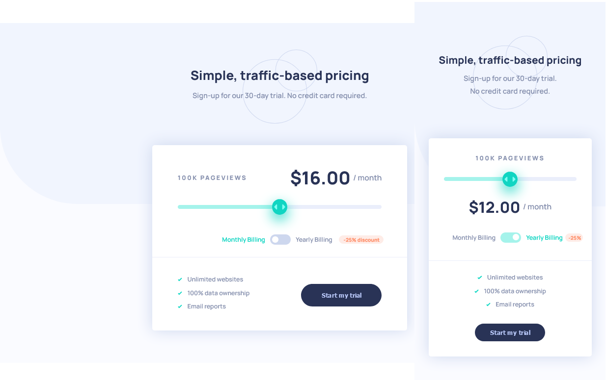

# Frontend Mentor - Interactive pricing component solution

This is a solution to the [Interactive pricing component challenge on Frontend Mentor](https://www.frontendmentor.io/challenges/interactive-pricing-component-t0m8PIyY8). Frontend Mentor challenges help you improve your coding skills by building realistic projects.

## Table of contents

- [Overview](#overview)
  - [The challenge](#the-challenge)
  - [Screenshot](#screenshot)
  - [Links](#links)
- [My process](#my-process)
  - [Built with](#built-with)
  - [What I learned](#what-i-learned)
  - [Continued development](#continued-development)
- [Author](#author)

## Overview

### The challenge

Users should be able to:

- View the optimal layout for the app depending on their device's screen size
- See hover states for all interactive elements on the page
- Use the slider and toggle to see prices for different page view numbers

### Screenshot

### Links

- Solution URL: [My solution](https://adoring-meitner-632781.netlify.app/)

## My process

### Built with

- Semantic HTML5 markup
- CSS custom properties
- Flexbox
- CSS Grid
- JavaScript
- Mobile-first workflow

### What I learned

The main objective for this project was to practice breaking down the provided project design and translate it into markup for the browser. To accomplish this I intentionally slowed down and put in the time to think about the design and plan out build. In doing so I was able to keep a structured workflow and methodically work through problems.

As I chose to not use a CSS preprocessor or framework for this project, I found styling the range input elements to be particularly challenging, as I had not previously understood the current limitations. I did end up using the browser extension pseudo classes (i.e. -webkit-, -moz-, -ms-), which MDN states are not recommended for production code, though perhaps later I'll attempt to style these differently upon revisit.

An additional objective for this project was to practice building responsive layouts using Flexbox and CSS Grid. Initially, I started with Flexbox only, but realized using CSS Grid will be useful for positioning the Pageviews and Price amounts on viewport change.

The working functionality of the component was written with JavaScript. I followed an Object Oriented design approach, such that the component would be encapsulated and able to be exported.

One minor styling change I added to the design was to toggle the billing timing label color depending on the switch box state, I think this improves the usability by readily displaying if you've selected monthly or yearly billing.

## Author

- Website - [Mike Uffelman](https://github.com/mike-uffelman)
- Frontend Mentor - [@mike-uffelman](https://www.frontendmentor.io/profile/mike-uffelman)
